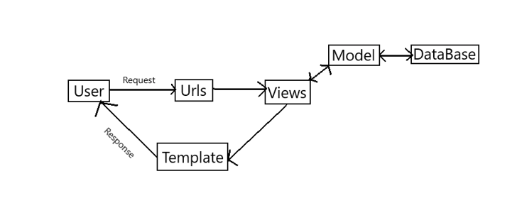
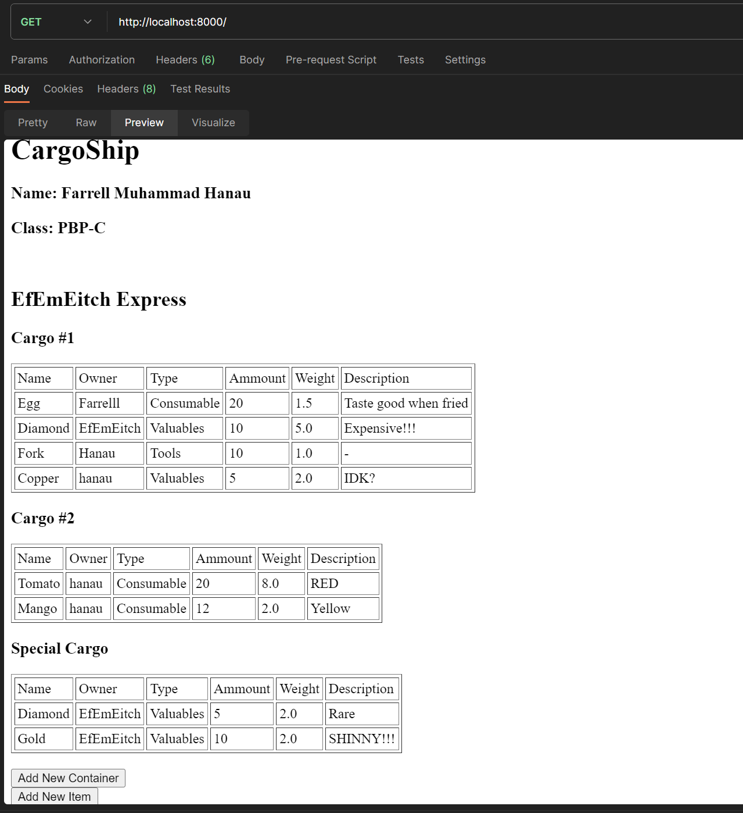
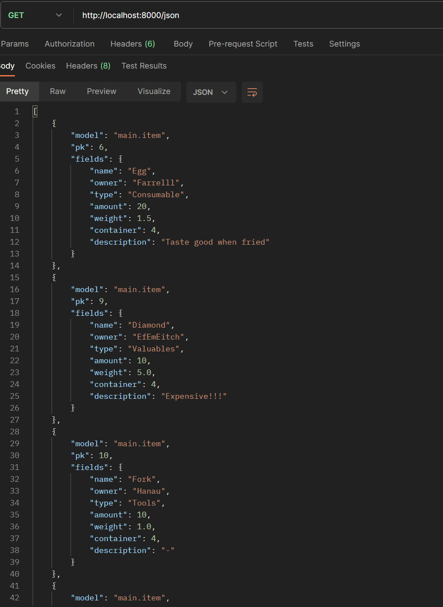
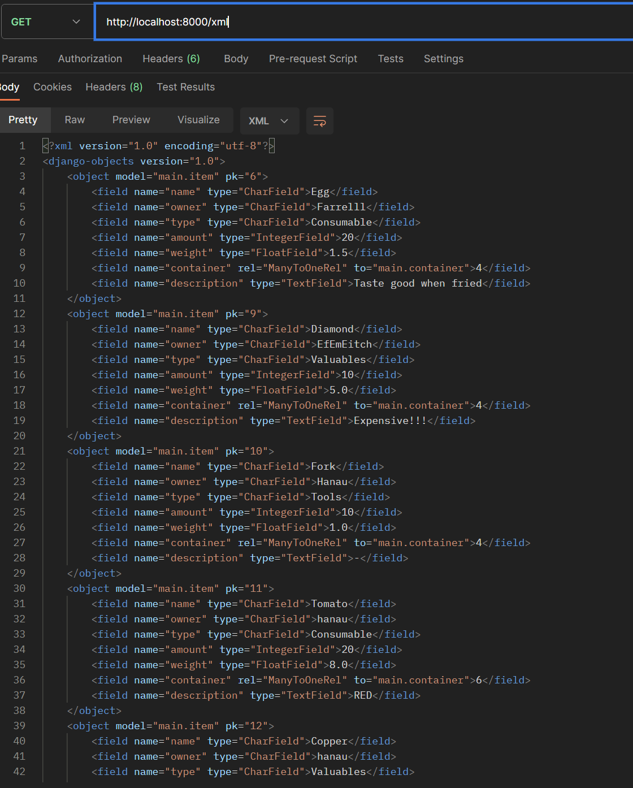
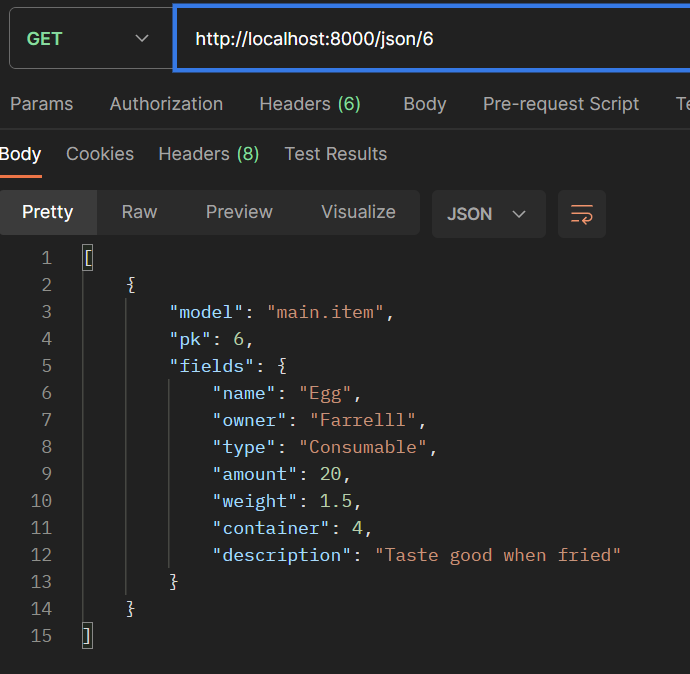
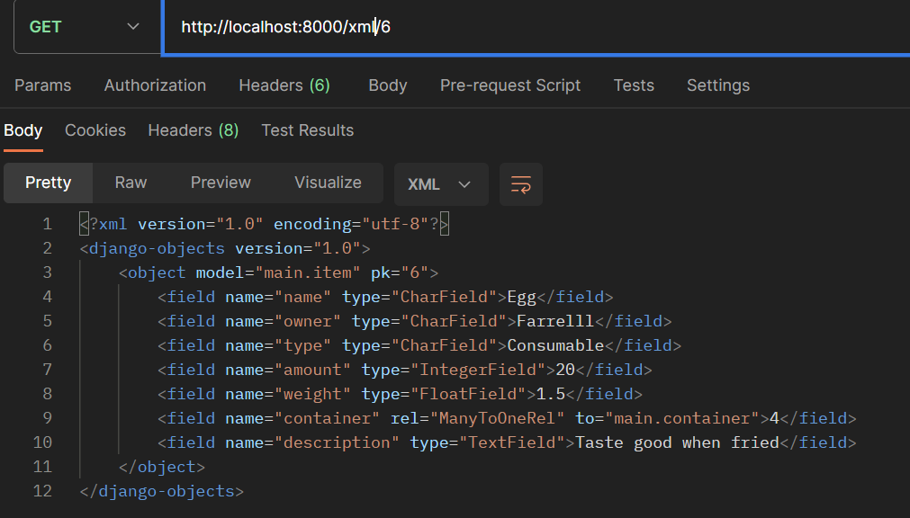

link utama: https://cargoship.adaptable.app

link main : https://cargoship.adaptable.app/main

# Tugas 1

1. Jelaskan bagaimana cara kamu mengimplementasikan checklist di atas secara step-by-step (bukan hanya sekadar mengikuti tutorial).

    - Membuat sebuah projek Django baru
        + Membuat direktori baru dengan nama cargoship
        + Menginisialisasi direktori tersebut menjadi repositori git dengan perintah "git init"
        + Membuat repositori github baru dengan nama "cargoship" dan visibility public
        + Membuat virtual environment pada repo tersebut dengan perintah "python -m venv env"
        + Membuat file teks baru dengan nama "requirements.txt" lalu mengisinya dengan beberapa dependencies sesuai dengan keperluan
            ```
            django
            gunicorn
            whitenoise
            psycopg2-binary
            requests
            urllib3 
            ```
        + Menjalankan virtual environment dengan menjalankan script "env\Scripts\activate.bat"
        + Meng-install dependencies tersebut dengan perintah "pip install -r requirements.txt" 
        + Menambah file .gitignore yaitu file yang berisi daftar-daftar file atau direktori yang akan diabaikan oleh git
        + Membuat projek django dengan perintah "django-admin startproject cargoship ."
        + Menambahkan "*" pada ALLOWED_HOST di settings.py yang berada di direktori cargoship
        + Menjalankan server django dengan perintah "python manage.py runserver" lalu buka link http://127.0.0.1:8000 untuk mengecek apakah server sudah dapat berjalan dengan baik atau belum.
        + Menekan tombol "CTRL-C" untuk mematikan server
    - Membuat aplikasi dengan nama main pada proyek tersebut
        + Membuat aplikasi baru bernama main dengan perintah "python manage.py startapp main"
        + Memasukan main ke dalam daftar aplikasi proyek dengan menambahkan "main" pada variable INSTALLED_APPS yang ada di settings.py yang berada pada directori cargoship
    - Melakukan routing pada proyek agar dapat menjalankan aplikasi main
        + Mengimport "include" dari "django.urls"
        + Menambahkan "path('main/', include(main.urls)) di dalam variable list "urlpatterns" dimana 'main/' sendiri merupakan path url dari applikasi main 
        + Mengecek apakah applikasi main sudah dapat dijalankan dengan membuka link http://127.0.0.1:8000/main
    - Membuat model pada aplikasi main dengan nama Item dan memiliki atribut wajib sesuai dengan yang ada pada soal
        + Pada main\models.py, mengimport "models" dari "django.db"
        + Membuat class baru bernama "Item" yang meng-inherit dari class "models.Model"
        + Menambahkan beberapa attribut pada kelas Item sebagai berikut:
            ```
            class Item(models.Model):
                name = models.CharField(max_length=255)
                owner = models.CharField(max_length=255)
                type = models.CharField(max_length=255)
                amount = models.IntegerField()
                weight = models.FloatField()
                description = models.TextField()
            ```
        + Melakukan migrasi model dengan perintah "python manage.py makemigrations" lalu melakukan migrasi ke basis data lokal dengan perintah "python manage.py migrate"
    - Membuat sebuah fungsi pada views.py untuk dikembalikan ke dalam sebuah template HTML yang menampilkan nama aplikasi serta nama dan kelas
        + Membuat file "views.py" pada folder main
        + Di dalam file tersebut, mengimport "render" dari "django.shortcuts"
        + Membuat fungsi show_main dengan parameter "request" yang berguna untuk menampilkan app main sesuai dengan template
        + Membuat variable dictionary bernama context dengan isi sebagai berikut:
            ```
            context = {
                'Cargo1':
                {
                    'Item1': 
                    {
                        'name': 'Tomato',
                        'owner': 'Farrell',
                        'type': 'Consumable',  
                        'ammount': '10',
                        'weight': '1.3'
                    },
                    'Item2':
                    {
                        'name': 'Spoon',
                        'owner': 'Farrell',
                        'type': 'Tools',  
                        'ammount': '8',
                        'weight': '0.8'
                    },
                    'Item3':
                    {
                        'name': 'Phone',
                        'owner': 'Hanau',
                        'type': 'Electronic',
                        'ammount': '5',
                        'weight': '1'
                    }
                },
                'Cargo2':
                {
                    'Item1':
                    {
                        'name': 'Gasoline',
                        'owner': 'Unknown',
                        'type': 'Flammable',
                        'ammount': '2',
                        'weight': '5.7'
                    },
                    'Item2':
                        {
                            'name': 'Diesel',
                            'owner': 'Unknown',
                            'type': 'Flammable',
                            'ammount': '3',
                            'weight': '9.6'
                        }
                }
            }
            ```
            + Mereturn "render (request, 'main.html', context)" dimana 'main.html' merupakan template yang akan digunakan
            + Membuat folder "templates" pada direktori "main" dan di dalamnya, membuat file "main.html"
            + Mengisi main.html dengan nama, kelas, dan Item yang ada dalam context. Karena dalam context terdapat beberapa Item, maka dapat menggunakan for-each loop untuk mengambil setiap Item dari dalam masing-masing "cargo"
            + Mengecek apakah tampilan sudah sesuai dengan keinginan dengan menjalankan server dan mengunjungi http://127.0.0.1:8000/main
        - Membuat sebuah routing pada "urls.py" aplikasi main untuk memetakan fungsi yang telah di buat pada "views.py"
            + Mengimport "path" dari "django.urls" dan show_main dari "main.views"
            + menambahkan *path* baru pada pada variable "urlpatterns" dengan cara menambahkan "path('', show_main, name='show_main')"
        - Melakukan deployment ke Adaptable terhadap aplikasi yang sudah dibuat
            + Menghubungkan repositori lokal dengan repositori github dengan perintah "git remote add origin https://github.com/FarrellMuhammadHanau/cargoship.git"
            + Menyimpan repositori lokal / perubahan repositori lokal ke github dengan perintah "git add ." untuk menandai bahwa semua file siap untuk di commit, lalu "git commit -u <komentar>" untuk menyimpan perubahan lalu menyimpannya ke dalam github dengan perintah "git push -u origin main".
            + Setelah itu membuka web Adaptable.io lalu tekan tombol "new app" dan pilih "Connect an Existing Repository" Lalu pilih repo "cargoship"
            + Setelah itu pilih "Python App Template" sebagai template dan "PostgreSQL" sebagai basis data
            + Menyesuaikan versi python yang ada pada lokal ("Versi 3.10") lalu pada bagian "Start Command" tambahkan perintah "python manage.py migrate && gunicorn cargoship.wsgi"
            + Memasukan nama aplikasi dan mencentang "HTTP Listener on Port" lalu menekan tombol "Deploy App"

2. Buatlah bagan yang berisi request client ke web aplikasi berbasis Django beserta responnya dan jelaskan pada bagan tersebut kaitan antara "urls.py", "views.py", "models.py" dan berkas html.

    
    - URLS atau urls.py merupakan bagian yang menentukan pola url aplikasi. Pola url ini akan merujuk pada Views dari aplikasi tersebut.
    - Views atau views.py akan menampilkan laman sesuai dengan Template yang dipilih dengan data yang sesuai dengan Model.
    - Template menentukan tampilan dari website dan dapat menampilkan data yang didapat melewati Views
    - Model atau models.py menentukan bentuk atau struktur dari data-data yang ada pada database
    - Database merupakan tempat dimana data-data aplikasi disimpan

3. Jelaskan mengapa kita menggunakan virtual environment? Apakah kita tetap dapat membuat aplikasi web berbasis Django tanpa menggunakan virtual environment?

    *Virtual environment* merupakan suatu ruang lingkup virtual yang memungkinkan kita untuk mengisolasi *dependencies* yang kita butuhkan dengan *dependencies* yang ada pada mesin lokal. Fitur ini sangat berguna karena aplikasi web yang kita buat terkadang membutuhkan versi *dependencies* yang berbeda dengan yang ada pada komputer kita. Namun meskipun begitu, kita tetap dapat membuat aplikasi web berbasis Django tanpa menggunakan *virtual environment* dengan syarat bahwa versi *dependencies* yang digunakan dalam membuat aplikasi web tersebut sama dengan versi *dependencies* yang ada pada mesin lokal. 

4. Jelaskan apakah itu MVC, MVT, MVVM dan perbedaan dari ketiganya.

    MVC (Model-View-Control), MVT (Model-View-Template), dan MVVM (Model-View-ViewModel) merupakan pola desain yang digunakan dalam mendesain suatu software. Elemen-elemen pada software dipisah sesuai dengan pola desain tersebut untuk memudahkan developer dalam mengelola dan mengembahkan software tersebut.
    - MVC membagi komponen-komponen aplikasi menjadi:
        + Model berfungsi dalam mengelola data
        + View berfungsi dalam mengatur *User Interface* atau *UI* dari suatu aplikasi 
        + Control berfungsi sebagai penghubung antara Model dengan View. Control dapat memanipulasi data menggunakan model dan me-*render* hasil akhir sesuai dengan view.
    - MVT membagi komponen-komponen aplikasi menjadi:
        + Model berfungsi dalam mengelola data
        + View berfungsi sebagai penghubung antara Model dan Template. View dapat mengambil data dari basis data melalui Model dan menampilkan data tersebut menggunakan Template
        + Template berfungsi dalam mengatur tampilan dan menampilkan data melalui View
    - MVVM membagi komponen-komponen aplikasi menjadi:
        + Model berfungsi dalam mengelola data
        + View berfungsi dalam mengatur User Interface dan terhubung dengan ViewModel melalui *Data Binding*
        + ViewModel berfungsi dalam menghubungkan Model dengan View
    Perbedaan ketiga pola desain tersebut terletak pada elemen penghubungnya dimana pada MVC, elemen penghubung terletak pada Control, pada MVT, elemen penghubungnya adalah View, sementara pada MVVM, elemen penghubungnya pada ViewModel. Selain itu, pada MVC, hubungan antara View dan Control satu arah sementara pada MVVM, hubungan antara View dan ViewModel dua arah karena adanya Data Binding

## Referensi:
Gallardo, Estefania Garcia. (2023). *What is MVVM Architecture?*. Retrieved from https://builtin.com/software-engineering-perspectives/mvvm-architecture

# Tugas 2

1. Apa perbedaan form POST dan form GET dalam django?

    Pada django, form POST digunakan untuk mengirimkan data pada server dengan tujuan mengubah atau menambahkan data pada server tersebut. Sementara itu, form GET digunakan untuk mengambil data pada server tanpa mengubah data pada server dimana form tersebut akan meminta input berupa *identifier* atau kata kunci untuk mencari data yang diinginkan.

2. Apa perbedaan utama antara XML, JSON, dan HTML dalam konteks pengiriman data?
    - XML menggunakan tag dan atribut untuk mendefinisikan suatu struktur data. Pada umumnya, XML lebih mudah untuk dibaca bagi manusia sehingga mudah untuk *debugging*. Selain itu, XML dapat merepresentasikan berbagai data yang kompleks.
    - JSON menggunakan *key-value pair* dalam menentukan menyimpan suatu data dimana key merupakan tipe data serta value adalah nilai dari data tersebut. Kelebihan JSON yang membuatnya sering dipakai dalam API web adalah kompabilitasnya dengan javascript dimana javascript dapat mengubah JSON menjadi objek javascript dengan mudah.
    - HTML merupakan *markup language* yang digunakan untuk membuat tampilan dari suatu website. Berbeda dengan XML dan JSON, HTML lebih cocok digunakan dalam presentasi suatu data dibandingkan untuk pengiriman data.

3. Mengapa JSON sering digunakan dalam pertukaran data antara aplikasi web modern?
    Alasan mengapa JSON sering digunakan pada web modern yaitu karena Kompatibilitasnya dengan bahasa pemrograman JavaScript, dimana JavaScript dapat mengubah isi dari JSON menjadi objek javascript. Selain itu, JSON memiliki format data yang lebih ringan dan sederhana dibandingkan dengan XML. Selain itu, JSON mudah untuk di*parsing* dengan cepat sehingga memudahkan proses transfer data. JSON juga *compatible* dengan beberapa bahasa pemrograman selain javascript seperti python, java, C#, php, dll.

4. Jelaskan bagaimana cara kamu mengimplementasikan *checklist* di atas secara *step-by-step* (bukan hanya sekadar mengikuti tutorial).

    - Membuat input form untuk menambahkan objek model pada app sebelumnya
        + Mengubah routing aplikasi main dari 'main/' menjadi '' pada file 'urls.py' di folder cargoship agar link url menjadi lebih simple
        + Membuat folder 'templates' pada root lalu membuat file 'base.html' didalamnya sebagai kerangka dari template-template yang akan digunakan dikedepannya.
        ```
        
        <!DOCTYPE html>
        <html lang="en">
            <head>
                <meta charset="UTF-8" />
                <meta
                    name="viewport"
                    content="width=device-width, initial-scale=1.0"
                />
                
                
            </head>

            <body>
                
                
            </body>
        </html>
        ```
        + Menambahkan "'DIRS': [DIRSBASE_DIR / 'templates']" pada baris 'TEMPLATES' yang ada pada 'settings.py' untuk memberi tahu dimana letak template tersebut
        ```
        TEMPLATES = [
            {
                'BACKEND': 'django.template.backends.django.DjangoTemplates',
                'DIRS': [BASE_DIR / 'templates'],
                'APP_DIRS': True,
                'OPTIONS': {
                    'context_processors': [
                        'django.template.context_processors.debug',
                        'django.template.context_processors.request',
                        'django.contrib.auth.context_processors.auth',
                        'django.contrib.messages.context_processors.messages',
                    ],
                },
            },
        ]
        ```
        + Membuat file 'forms.py' di folder 'main' lalu mengimport beberapa module/class/fungsi yang dibutuhkan
        ```
        from django.forms import ModelForm, ChoiceField
        from main.models import Item, Container
        ``` 
        + membuat class ItemForm dan ContainerForm yang masing-masing menerima data Item dan Container baru (pada tugas ini, saya menambahkan model data baru yaitu Container dengan relasi one to many dengan Item).
        ```
        class ItemForm(ModelForm):
            class Meta:
                model = Item
                fields = ["name", "owner", "type", "amount", "weight", "container", "description"]

            type_choices = [
                ('Consumable', 'Consumable'),
                ('Tools', 'Tools'),
                ('Electronic', 'Electronic'),
                ('Fuel', 'Fuel'),
                ('Valuables', "Valuables")
            ]

            type = ChoiceField(choices=type_choices)

        class ContainerForm(ModelForm):
            class Meta:
                model = Container
                fields = ["name"]
        ```
        + Mengimport beberapa module/class/fungsi yang dibutuhkan pada file 'views.py'
        ```
        from main.forms import ItemForm, ContainerForm
        from django.http import HttpResponseRedirect, HttpResponse
        from django.urls import reverse
        ```
        + Membuat fungsi 'create_item' dan 'create_container' dimana didalam fungsi tersebut akan dicek apakah input form valid atau serta untuk container, nama tidak boleh duplikat.
        ```        
        def create_item(request):
            form = ItemForm(request.POST or None)

            if form.is_valid() and request.method == "POST":
                form.save()
                return HttpResponseRedirect(reverse('main:show_main'))
            
            context = {'form': form}
            return render(request, "create_item.html", context)

        def create_container(request):
            form = ContainerForm(request.POST or None)
            if form.is_valid() and request.method == "POST":
                name = form.cleaned_data['name']
                if (name not in [container.name for container in Container.objects.all()]):
                    form.save()
                    return HttpResponseRedirect(reverse('main:show_main'))
            
            context = {'form': form}
            return render(request, "create_container.html", context)
        ```
        + Membuat template 'create_container.html' yang akan dirender oleh fungsi 'create_container' pada 'views.py'
        ```
         

        
        <h1>Add New Container</h1>

        <form method="POST">
            
            <table>
                {{ form.as_table }}
                <tr>
                    <td></td>
                    <td>
                        <input type="submit" value="Add Container"/>
                    </td>
                </tr>
            </table>
        </form>

        
        ```
        + Membuat template 'create_item.html' yang akan dirender oleh fungsi 'create_item' pada 'views.py'
        ```
         

        
        <h1>Add New Item</h1>

        <form method="POST">
            
            <table>
                {{ form.as_table }}
                <tr>
                    <td></td>
                    <td>
                        <input type="submit" value="Add Item"/>
                    </td>
                </tr>
            </table>
        </form>

        
        ```
        + Mengimport fungsi 'create_item' dan 'create_container' dari 'main.views'
        + Menambahkan path untuk fungsi views tersebut sebagai berikut:
        ```
        path('create-item/',create_item, name='create_item'),
        path('create-container/', create_container, name='create_container'),
        ```
        + Mengetes apakah form tersebut sudah dapat berjalan dengan menjalankan server local lalu mengakses 'http://localhost:8000/create-item/' dan 'http://localhost:8000/create-container/'
    
    - Menambahkan fungsi views untuk melihat objek dalam format HTML
        + Mengubah fungsi 'show_main' pada 'views.py' agar dapat menampilkan data yang ada pada basis data
        ```
        def show_main(request):
            containers = Container.objects.all()
            context = {
                'name': 'Farrell Muhammad Hanau',
                'class': 'PBP-C',
                'shipper': 'EfEmEitch Express',
                'containers': containers

            }
            
            return render (request, 'main.html', context)
        ```
        + Di dalam template 'main.html' akan dilakukan loop untuk setiap objek Container. Hal ini dilakukan untuk menampilkan setiap objek Item yang ada didalam Container tersebut
    
    - Membuat fungsi views untuk melihat objek dalam format XML dan JSON
        + Mengimport 'HttpResponse' dari 'django.http' serta 'serializers' dari 'django.core'
        + Membuat fungsi 'show_json' untuk format json dan 'show_xml' untuk format XML.
        ```
        def show_json(request):
            data = Item.objects.all()
            return HttpResponse(serializers.serialize("json", data), content_type="application/json")

        def show_xml(request):
            data = Item.objects.all()
            return HttpResponse(serializers.serialize("xml", data), content_type="application/xml")
        ```
        + 'serializers.serialize("json", data)' dan 'serializers.serialize("xml", data)' digunakan untuk mengubah data menjadi format JSON atau XML.
    
    - Membuat fungsi views untuk melihat objek dalam format XML dan JSON
        + Membuat fungsi 'show_json_by_id' dan 'show_xml_by_id' pada 'views.py' yang keduanya memiliki 2 parameter yaitu request dan id, dimana parameter id tersebut digunakan untuk mem-*filter* objek sesuai dengan id dari objek tersebut
        ```
        def show_json_by_id(request, id):
            data = Item.objects.filter(pk=id)
            return HttpResponse(serializers.serialize("json", data), content_type="application/json")

        def show_xml_by_id(request, id):
            data = Item.objects.filter(pk=id)
            return HttpResponse(serializers.serialize("xml", data), content_type="application/xml")

        ```
    
    - Membuat routing URL untuk masing-masing views yang telah ditambahkan
        + Mengimport kelima fungsi views tersebut dari 'main.views.py' kedalam 'urls.py' pada main.
        ```
        from main.views import show_main, show_json, show_xml, show_xml_by_id, show_json_by_id

        ``` 
        + Pada 'urlpatterns', menampahkan path sebagai berikut
        ```
        urlpatterns = [
            ........
            path('', show_main, name='show_main'),
            path('json/', show_json, name='show_json'),
            path('xml/', show_xml, name='show_xml'),
            path('json/<int:id>/', show_json_by_id, name='show_json_by_id'),
            path('xml/<int:id>/', show_xml_by_id, name='show_xml_by_id'),
            ........
        ]
        ```
        + Id pada akhir url 'json/<int:id>/' dan 'xml/<int:id>/' akan ditangkap oleh fungsi 'show_json_by_id' dan 'show_xml_by_id' yang digunakan untuk menyaring objek

5. Mengakses kelima URL di poin 2 menggunakan Postman, membuat screenshot dari hasil akses URL pada Postman, dan menambahkannya ke dalam README.md
    - format HTML
        
    - format JSON
        
    - format XML
        
    - format JSON dengan ID (objek yang dipilih memiliki id = 6)
        
    - format XML dengan ID (objek yang dipilih memiliki id = 6)
        

